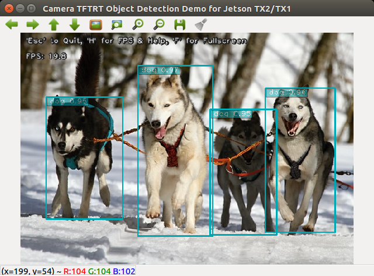

TensorFlow/TensorRT Models on Jetson
====================================

This repository was forked from NVIDIA's [tf_trt_models](https://github.com/NVIDIA-Jetson/tf_trt_models) repository.  It contains sctipts to optimize TensorFlow models with TensorRT, as well as scripts for testing/demo.  The models are sourced from the [TensorFlow models repository](https://github.com/tensorflow/models).  This repository mainly focuses on **object detection** models.

* [Setup](#setup)
* [Object Detection](#od)
  * [Models](#od_models)
  * [Real-time Object Detection with TensorRT Optimized Models](#rt_od)
* [Applying the Hand Detector Model](#hand)

<a name="setup"></a>
Setup
-----

Refer to these blog posts for more details: [TensorFlow/TensorRT Models on Jetson TX2](https://jkjung-avt.github.io/tf-trt-models/) and [https://jkjung-avt.github.io/tf-trt-revisited/](https://jkjung-avt.github.io/tf-trt-revisited/).

1. Flash the target Jetson TX2 system with either JetPack-3.2.1 (TensorRT 3.0 GA included) or JetPack 3.3 (TensorRT 4.0 GA).  (I have also tested the code on Jetson Nano with JetPack-4.2.)
2. Install OpenCV 3.4.x on Jetson.  Reference: [How to Install OpenCV (3.4.0) on Jetson TX2](https://jkjung-avt.github.io/opencv3-on-tx2/) or [Installing OpenCV 3.4.6 on Jetson Nano](https://jkjung-avt.github.io/opencv-on-nano/).
3. Download and install tensorflow-1.8.0 (with TensorRT support).  More specifically, download [this pip wheel](https://nvidia.app.box.com/v/TF180-Py35-wTRT) if you are using JetPack-3.2.1, or [this pip wheel](https://drive.google.com/open?id=1bAUNe26fKgGXuJiZYs1eT2ig8SCj2gW-) if you are using JetPack-3.3.  Then install it with `pip3`.

   ```
   $ sudo pip3 install tensorflow-1.8.0-cp35-cp35m-linux_aarch64.whl
   ```

   **2019-05-24 update:** Originally I encountered "extremely long TF-TRT model loading time issue" when I tested with tensorflow-1.9.0+.  That's why I recommended tensorflow-1.8.0 before.  Recently I realized the issue was due to the python3 'protobuf' module, and I have a solution.  I documented the solution in my [TensorFlow/TensorRT (TF-TRT) Revisted](https://jkjung-avt.github.io/tf-trt-revisited/) post.  With the solution applied, you could actually use any tensorflow of version 1.8.0 or higher, as long as it has the TenroRT support.  For example, you could [build/install tensorflow-1.12.2 from source](https://jkjung-avt.github.io/build-tensorflow-1.12.2/), or just use a pip3 wheel provided by NVIDIA.

4. Clone this repository.  (Do use this repository instead of NVIDIA's original tf_trt_models repository, if you would like to run the script described below.)

   ```
   $ cd ~/project
   $ git clone --recursive https://github.com/jkjung-avt/tf_trt_models
   $ cd tf_trt_models
   ```

5. Run the installation script.

   ```
   $ ./install.sh
   ```

<a name="od"></a>
Object Detection 
----------------

Please refer to the original [NVIDIA-Jetson/tf_trt_models](https://github.com/NVIDIA-Jetson/tf_trt_models) for code snippets which demonstrate how to download pretrained object detection models, how to build TensorFlow graph and how to optimize the models with TensorRT.

<a name="od_models"></a>
### Models

The author has tested various TensorFlow object detection models and shared the result on [NVIDIA's Jetson TX2 Developer Forum](https://devtalk.nvidia.com/default/topic/1037019/jetson-tx2/tensorflow-object-detection-and-image-classification-accelerated-for-nvidia-jetson/post/5288250/#5288250).

Note the benchmark timings were gathered after the Jetson TX2 was placed in MAX-N mode.  To set TX2 into MAX-N mode, run the following commands in a terminal:

```
$ sudo nvpmodel -m 0
$ sudo ~/jetson_clocks.sh
```

<a name="rt_od"></a>
### Real-time Object Detection with TensorRT Optimized Models

The `camera_tf_trt.py` script supports video inputs from one of the following sources: (1) a video file, say mp4, (2) an image file, say jpg or png, (3) an RTSP stream from an IP CAM, (4) a USB webcam, (5) the Jetson onboard camera.  Check out the help message about how to invoke the script with a specific video source.

```
$ python3 camera_tf_trt.py --help
usage: camera_tf_trt.py [-h] [--file] [--image] [--filename FILENAME] [--rtsp]
                        [--uri RTSP_URI] [--latency RTSP_LATENCY] [--usb]
                        [--vid VIDEO_DEV] [--width IMAGE_WIDTH]
                        [--height IMAGE_HEIGHT] [--model MODEL] [--build]
                        [--tensorboard] [--labelmap LABELMAP_FILE]
                        [--num-classes NUM_CLASSES] [--confidence CONF_TH]

This script captures and displays live camera video, and does real-time object
detection with TF-TRT model on Jetson TX2/TX1

optional arguments:
  -h, --help            show this help message and exit
  --file                use a video file as input (remember to also set
                        --filename)
  --image               use an image file as input (remember to also set
                        --filename)
  --filename FILENAME   video file name, e.g. test.mp4
  --rtsp                use IP CAM (remember to also set --uri)
  --uri RTSP_URI        RTSP URI, e.g. rtsp://192.168.1.64:554
  --latency RTSP_LATENCY
                        latency in ms for RTSP [200]
  --usb                 use USB webcam (remember to also set --vid)
  --vid VIDEO_DEV       device # of USB webcam (/dev/video?) [1]
  --width IMAGE_WIDTH   image width [1280]
  --height IMAGE_HEIGHT
                        image height [720]
  --model MODEL         tf-trt object detecion model [ssd_inception_v2_coco]
  --build               re-build TRT pb file (instead of usingthe previously
                        built version)
  --tensorboard         write optimized graph summary to TensorBoard
  --labelmap LABELMAP_FILE
                        [third_party/models/research/object_detection/data/msc
                        oco_label_map.pbtxt]
  --num-classes NUM_CLASSES
                        number of object classes [90]
  --confidence CONF_TH  confidence threshold [0.3]
```

The `--model` option could only be set to `ssd_inception_v2_coco` (default) or `ssd_mobilenet_v1` now.  It would likely be extended to support more object detection models in the future.  The `--build` option only needs to be done once for each object detection model.  The TensorRT optimized graph would be saved/cached into a protobuf file, so that later invocations of the script could load the cached graph directly without going through the optimization process again.


Example #1: build TensorRT optimized 'ssd_mobilenet_v1_coco' model and run real-time object detection with USB webcam.

```
$ python3 camera_tf_trt.py --usb --model ssd_mobilenet_v1_coco --build
```

Example #2: verify the optimized 'ssd_mobilenet_v1_coco' model with NVIDIA's original 'huskies.jpg' picture. 

```
$ python3 camera_tf_trt.py --image --filename examples/detection/data/huskies.jpg --model ssd_mobilenet_v1_coco
```

Here is the result of example #2.

<p>

</p>

<a name="hand"></a>
Applying the Hand Detector Model
--------------------------------

Refer to the following blog posts for more details:

* [Training a Hand Detector with TensorFlow Object Detection API](https://jkjung-avt.github.io/hand-detection-tutorial/)
* [Deploying the Hand Detector onto Jetson TX2](https://jkjung-avt.github.io/hand-detection-on-tx2/)

After you've trained your own hand detector with one of the following models, you'll be able to optimize the model with TF-TRT and run it on TX2.

```
ssd_mobilenet_v1_egohands
ssd_mobilenet_v2_egohands
ssdlite_mobilenet_v2_egohands
ssd_inception_v2_egohands
faster_rcnn_resnet50_egohands
faster_rcnn_resnet101_egohands
faster_rcnn_inception_v2_egohands
```

Be sure to copy your trained model checkpoint files into the corresponding `data/xxx_egohands/` folder.  Say, you've done that for `ssd_mobilenet_v1_egohands`.  Then you could optimize the model and test it with an image like this:

```shell
$ python3 camera_tf_trt.py --image \
                           --filename jk-son-hands.jpg \
                           --model ssd_mobilenet_v1_egohands \
                           --labelmap data/egohands_label_map.pbtxt \
                           --num-classes 1 \
                           --build
```

<p>

</p>
